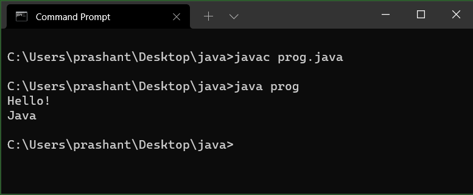

# Introduction to Java

## Introduction to Java
--------------------------
JAVA was developed by James Gosling at Sun Microsystems Inc in the year 1991, later acquired by Oracle Corporation. It is a simple programming language. Java makes writing, compiling, and debugging programming easy. It helps to create reusable code and modular programs.

Java is a class-based, object-oriented programming language and is designed to have as few implementation dependencies as possible. A general-purpose programming language made for developers to write once run anywhere that is compiled Java code can run on all platforms that support Java. Java applications are compiled to byte code that can run on any Java Virtual Machine. The syntax of Java is similar to c/c++.

## History of Java
--------------------------
Java’s history is very interesting. It is a programming language created in 1991. James Gosling, Mike Sheridan, and Patrick Naughton, a team of Sun engineers known as the Green team initiated the Java language in 1991. Sun Microsystems released its first public implementation in 1996 as Java 1.0. It provides no-cost -run-times on popular platforms. Java1.0 compiler was re-written in Java by Arthur Van Hoff to strictly comply with its specifications. With the arrival of Java 2, new versions had multiple configurations built for different types of platforms.

In 1997, Sun Microsystems approached the ISO standards body and later formalized Java, but it soon withdrew from the process. At one time, Sun made most of its Java implementations available without charge, despite their proprietary software status. Sun generated revenue from Java through the selling of licenses for specialized products such as the Java Enterprise System.

On November 13, 2006, Sun released much of its Java virtual machine as free, open-source software. On May 8, 2007, Sun finished the process, making all of its JVM’s core code available under open-source distribution terms.

The principles for creating java were simple, robust, secured, high performance, portable, multi-threaded, interpreted, dynamic, etc. James Gosling in 1995 developed Java, who is known as the Father of Java. Currently, Java is used in mobile devices, internet programming, games, e-business, etc.

## Application and Applet
--------------------------
Java can be used to create two types of programs:

* Applications: _Java Application is just like a Java program that runs on an underlying operating system with the support of a virtual machine. It is also known as an application program. The graphical user interface is not necessary to execute the java applications, it can be run with or without it._

* Applet: _An applet is a Java program that can be embedded into a web page. It runs inside the web browser and works at client side. An applet is embedded in an HTML page using the APPLET or OBJECT tag and hosted on a web server. Applets are used to make the web site more dynamic and entertaining._

|                                                 Java Application                                          |                                                                     Java Applet                                                                   |
|-----------------------------------------------------------------------------------------------------------|---------------------------------------------------------------------------------------------------------------------------------------------------|
|Applications are just like a Java programs that can be execute independently without using the web browser.|Applets are small Java programs that are designed to be included with the HTML web document. They require a Java-enabled web browser for execution.|
|Application program requires a main function for its execution.                                            |Applet does not require a main function for its execution.                                                                                         |
|Java application programs have the full access to the local file system and network.                       |Applets don’t have local disk and network access.                                                                                                  |
|Applications can access all kinds of resources available on the system.                                    |Applets can only access the browser specific services. They don’t have access to the local system.                                                 |
|Applications can executes the programs from the local system.                                              |Applets cannot execute programs from the local machine.                                                                                            |
|An application program is needed to perform some task directly for the user.                               |An applet program is needed to perform small tasks or the part of it.                                                                              |

## Java Virtual Machine
-----------------------------
A Java virtual machine (JVM) is a virtual machine that enables a computer to run Java programs as well as programs written in other languages that are also compiled to Java bytecode. There are three execution phases of a program. They are written, compile and run the program.

* Writing a program is done by a java programmer like you and me.
* The compilation is done by the JAVAC compiler which is a primary Java compiler included in the Java development kit (JDK). It takes Java program as input and generates bytecode as output.
* In the Running phase of a program, JVM executes the bytecode generated by the compiler.

Now, we understood that the function of Java Virtual Machine is to execute the bytecode produced by the compiler. Every Operating System has a different JVM but the output they produce after the execution of bytecode is the same across all the operating systems. This is why Java is known as a platform-independent language. 

## Byte Code 
-------------------
In simple language, Java bytecode is the instruction set of the Java virtual machine (JVM). 
Byte code is an intermediate code between the source code and machine code. It is a low-level code that is the result of the compilation of a source code which is written in a high-level language. It is processed by a virtual machine like Java Virtual Machine (JVM).

Byte code is a non-runnable code after it is translated by an interpreter into machine code then it is understandable by the machine. It is compiled to run on JVM, any system congaing JVM can run it irrespective of their Operating System.

## Procedural Oriented Programming vs Object Oriented Programming
-----------------------------------------------------------------

### **Procedural Oriented Programming** 
_Related with the conventional style. This approach is also known as the top-down approach. In this approach, a program is divided into functions that perform specific tasks. This approach is mainly used for medium-sized applications. Data is global, and all the functions can access global data. The basic drawback of the procedural programming approach is that data is not secured because data is global and can be accessed by any function. Program control flow is achieved through function calls and goto statements._

### **Object Oriented Programming**
_Related with the real life objects and their properties. OOP Concepts:_

* Class and Objects
* Data abstraction
* Encapsulation
* Polymorphism
* Inheritance 

|                   OOP                 |               POP                 |
|---------------------------------------|-----------------------------------|
|It is Object oriented.                 |It is Procedure/Structure oriented.|
|Program is divided into objects.       |Program is divided into functions. |
|Bottom-up approach.                    |Top-down approach.                 |
|Inheritance property is used.          |Inheritance is not allowed.        |
|It uses access specifier.              |It doesn’t use access specifier.   |
|Interface is supported.                |Interface is not supported         |
|Encapsulation is used to hide the data.|No data hiding.                    |
|Concept of virtual function.           |No virtual function.               |
|For eg: C++, Java.                     |For eg: C, Pascal.                 |

## Compiling and Running a Simple Program
------------------------------
**Step 1**: Write a program on the notepad or any text editor and save it with .java (for example, ``prog.java``) extension.

Sample Program:

```Java
class prog  
{  
    public static void main(String args[])  
    {  
        System.out.println("Hello!");  
        System.out.println("Java");  
    }  
}  
```
**Step 2**: Open Command Prompt in the directory in which the .java file is saved.

**Step 3**: Use the following command to compile the Java program. It generates a .class file in the same folder. It also shows an error if any.

```
javac prog.java
```
**Step 4**: Use the following command to run the Java program:

```
java prog
```

